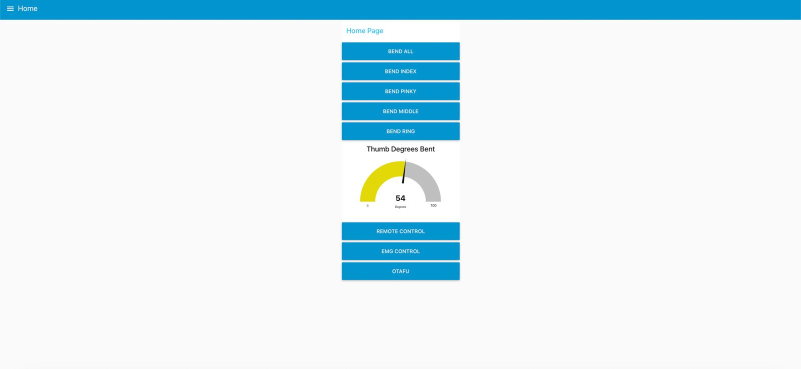
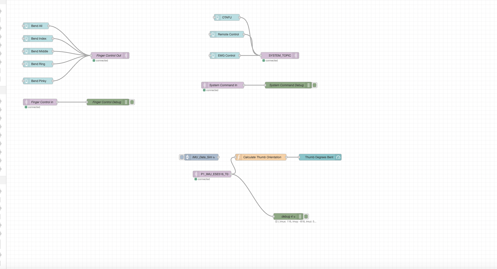

# a14g-final-submission

    * Team Number: T20
    * Team Name: The Ohmies
    * Team Members: Kevin Wang, Megha Mistry
    * Github Repository URL: https://github.com/ese5160/a14g-final-submission-s25-t20-the-ohmies.git
    * Description of test hardware: (development boards, sensors, actuators, laptop + OS, etc)  Laptop

## Link to webpage:

    https://ese5160.github.io/a14g-final-submission-s25-t20-the-ohmies/index.html
    

## 1. Video Presentation

    https://youtu.be/26BGSddgL1s

## 2. Project Summary

#### Device Description

This is a hand exoskeleton that improves the user's grip strength and finger dexterity, using four positional servo motors to help the patient bend their index, middle, ring finger and pinky at will. The motors can be triggered either via EMG signal or remote Wi-Fi control and one emergency stop button is also implemented in case of motor malfunctions.

#### What inspired you to do the project? What problem is your device solving?

We were inspired by the growing need for assistive technologies for stroke and neurological injury patients who struggle with hand mobility. This exoskeleton addresses the challenge of limited grip strength and finger dexterity that significantly impacts patients' quality of life and independence. By providing motorized assistance that works in harmony with the user's natural movements, our device serves as both a therapeutic tool and daily living aid.

#### How do you use the Internet to augment your device functionality?

Our device leverages internet connectivity in two key ways to enhance its therapeutic benefits:

First, we implemented a web-based control system that complements the EMG signal detection. Since EMG signals alone cannot reliably distinguish individual finger movements, our interface allows caregivers or medical professionals to remotely fine-tune the assistance level for each finger separately. This enables the creation of personalized therapy routines tailored to each patient's rehabilitation needs.

Second, our cloud-connected dashboard provides comprehensive visualization of recovery progress by tracking finger mobility metrics over time. Healthcare providers can monitor improvement trends, set achievable rehabilitation goals, and make data-driven adjustments to treatment plans—all based on quantitative measurements collected during device usage.

#### Device Functionality

Our internet-connected hand exoskeleton integrates several components into a cohesive assistive system. At its core, the device uses four positional servo motors to provide controlled assistance to each finger. EMG sensors detect the user's muscle signals, while a Wi-Fi-enabled SAMD21 processes these inputs and connects to our cloud platform. The system includes a emergency stop mechanism for safety and position sensors to accurately track finger movement angles. All components work together to provide responsive, precisely controlled finger assistance that adapts to the user's intentions while enabling remote monitoring and adjustment through our web interface.

#### Include your system-level block diagram here.

### Challenges

#### Where did you face difficulties? This could be in firmware, hardware, software, integration, etc. How did you overcome these challenges?

Our greatest challenge was calibrating the EMG sensors to reliably detect muscle signals across different users with varying muscle strengths and fatigue levels. We also encountered mechanical difficulties in creating a lightweight yet robust finger attachment system that could transfer force effectively without causing discomfort. These challenges were addressed through iterative testing with multiple users, implementing adaptive thresholding algorithms for the EMG signals, and redesigning the finger attachment points using more flexible materials with improved stress distribution.

### Prototype Learnings

#### What lessons did you learn by building and testing this prototype?

We learned that early user testing is critical for assistive technology, as theoretical designs often require significant modifications once actual patients interact with the device. The integration between hardware and software components proved more complex than anticipated, particularly in achieving low-latency response between EMG signal detection and motor activation. Additionally, we discovered the importance of designing for varied hand sizes and considering user fatigue during extended use sessions.

#### What would you do differently if you had to build this device again?

If given the opportunity to rebuild this device, we would focus on creating a more compact and portable design by miniaturizing the connections and enabling easier mounting mechanisms. We would implement a more rigorous testing schedule beginning earlier in the development process to identify usability issues before finalizing mechanical components. Additionally, we would invest more time in prototyping multiple iterations of the CAD models to optimize the ergonomics and weight distribution across different hand sizes before committing to the final design.

### Next Steps & Takeaways

#### What steps are needed to finish or improve this project?

The most crucial enhancement would be integrating force sensors on each finger to create an adaptive assistance system that responds to the patient's own efforts. This would allow the device to provide precisely the right amount of supplementary force based on real-time measurements of the patient's muscle activation, gradually decreasing assistance as strength improves—creating a truly responsive rehabilitation tool that evolves with the patient's recovery journey. We would also refine the web interface to display this force data alongside movement metrics, giving therapists more comprehensive insights into recovery progress.

#### What did you learn in ESE5160 through the lectures, assignments, and this course-long prototyping project?

ESE5160 provided invaluable insights into the complete lifecycle of IoT device development, from initial concept to functional prototype integrated with cloud services. The progression of assignments built our technical skills incrementally, particularly in firmware development and cloud connectivity, which proved essential for implementing the remote control features of our exoskeleton. Perhaps most importantly, the course taught us to approach hardware-software integration systematically, considering performance, reliability, and security at every stage of development.

### Project Links

##### Provide a URL to your Node-RED instance for our review (make sure it's running on your Azure instance!)

    http://20.42.95.23:1880/#flow/73619fbf95fb2705

#### Provide the share link to your final PCBA on Altium 365.

    https://upenn-eselabs.365.altium.com/designs/42FEF60D-4088-4639-AA8F-8E4493D43F92#design

## 3. Hardware & Software Requirements

### HRS

    - HRS-01: System shall use SAMD21 as the main microcontroller.
    - HRS-02: System shall use MyoWare EMG sensor with analog output.
    - HRS-03: System shall incorporate LSM6DSOX IMU sensors communicating via I2C.
    - HRS-04: System shall use four micro servo motors (MG90S), one on each of the index finger, middle finger, ring finger, and pinky for finger actuation.
    - HRS-05: System shall operate on a 3.7V Li-ion battery.
    - HRS-06: System shall include voltage regulation to 3.3V for MCU and sensors.
    - HRS-07: System shall use 5.0V boost converter to provide 5V voltage for servo motors.
    - HRS-08: System shall provide the user a minimum grip strength of 20 lbs.
    - HRS-09: System shall support individual control of 4 servo motors for independent finger actuation.
    - HRS-10: System shall include an emergency stop button to allow users to immediately disable all motor operations in case of failure.

### SRS

 - SRS-01: System shall use FreeRTOS for task scheduling and management.
 - SRS-02: EMG sampling task shall run at the highest priority with a 1000Hz sampling rate.
 - SRS-03: IMU data collection task shall run at 100Hz with medium priority.
 - SRS-04: Motor control task shall process EMG data and update servo positions at 50Hz.
 - SRS-05: Wi-Fi communication task shall transmit sensor data every 1 second at the lowest priority.
 - SRS-06: System shall implement interrupt-driven safety monitoring for motor control.
 - SRS-07: Task synchronization shall use FreeRTOS semaphores and mutexes to prevent data corruption.
 - SRS-08: System shall allow the user to modify motor parameters (e.g., finger position, speed, and torque limits) through Wi-Fi commands.
 - SRS-09: System shall implement an emergency stop function that disables all motor operations when the emergency button is pressed.
 - SRS-10: System shall process Wi-Fi commands within 100ms of receipt.
 - SRS-11: System shall support individual finger angle control from 0° to 90° with 1° resolution.
 - SRS-12: System shall implement a command protocol for:
    1. Emergency stop activation
    2.User-defined motor parameter adjustments

### Requirements Testing

#### Hardware Requirements Testing

| Requirement ID | Requirement Description | Testing Method | Status |
|----------------|-------------------------|----------------|--------|
| HRS-01 | System shall use SAMD21 as the main microcontroller | Verified hardware components in BOM and final assembly | ✅ Pass |
| HRS-02 | System shall use MyoWare EMG sensor with analog output | Measured analog output signal using oscilloscope to confirm functionality | ❌ Partial (Readings Wildly Inaccurate) |
| HRS-03 | System shall incorporate LSM6DSOX IMU sensors communicating via I2C | Verified I2C communication using logic analyzer and sensor data reading | ✅ Pass |
| HRS-04 | System shall use four micro servo motors (MG90S) | Physical inspection and testing of motor response | ✅ Pass |
| HRS-05 | System shall operate on a 3.7V Li-ion battery | Load-testing and measured input/output voltages on test points | ✅ Pass |
| HRS-06 | System shall include voltage regulation to 3.3V for MCU and sensors | Measured voltage output from regulator circuit | ✅ Pass |
| HRS-07 | System shall use 5.0V boost converter for servo motors | Measured voltage output at servo power pins | ❌ Partial (On-board boost converter failed) |
| HRS-08 | System shall provide the user a minimum grip strength of 20 lbs | Measured grip force using force gauge | ❌ Partial (16 lbs) |
| HRS-09 | System shall support individual control of 4 servo motors | Verified independent actuation of each finger | ✅ Pass |
| HRS-10 | System shall include an emergency stop button | Functionality verified through repeated emergency stop tests | ✅ Pass |

#### Software Requirements Testing

| Requirement ID | Requirement Description | Testing Method | Status |
|----------------|-------------------------|----------------|--------|
| SRS-01 | System shall use FreeRTOS for task scheduling | Code review and task execution verification | ✅ Pass |
| SRS-02 | EMG sampling task shall run at 1000Hz with highest priority | Measured sampling frequency using timing pins and oscilloscope | ✅ Pass |
| SRS-03 | IMU data collection at 100Hz with medium priority | Verified data collection rate through timing analysis | ✅ Pass |
| SRS-04 | Motor control task shall process EMG data at 50Hz | Measured motor update frequency with timing analysis | ✅ Pass |
| SRS-05 | Wi-Fi communication at at least 1 second intervals | Monitored data transmission using timer on the phone | ✅ Pass |
| SRS-06 | Interrupt-driven safety monitoring | Tested system response to various fault conditions | ✅ Pass |
| SRS-07 | Task synchronization using semaphores and mutexes | Verified through concurrent access testing and logging | ✅ Pass |
| SRS-08 | User modification of motor parameters via Wi-Fi | Tested per-finger control commands on the web interface | ✅ Pass |
| SRS-09 | Emergency stop function | Verified motor disabling in various operational states | ✅ Pass |
| SRS-10 | Process Wi-Fi commands within 100ms | Measured command response time on phone timer| ✅ Pass |
| SRS-11 | Individual finger angle control from 0° to 90° | Tested angle precision using protractor | ✅ Pass |
| SRS-12 | Command protocol implementation | Verified protocol functionality through test commands | ✅ Pass |

## 4. Project Photos & Screenshots

Our final project, including any casework or interfacing elements that make up the full project (3D prints, screens, buttons, etc)

The standalone PCBA, top

The standalone PCBA, bottom

Thermal camera images while the board is running under load

The Altium Board design in 2D view 

The Altium Board design in 3D view 

Node-RED dashboard (screenshot)

Node-RED backend (screenshot)

Block diagram of your system (You may need to update this to reflect changes throughout the semester.)

## Codebase

- A link to your final embedded C firmware codebases

    https://github.com/ese5160/final-project-t20-the-ohmies.git

- A link to your Node-RED dashboard code

    http://20.42.95.23:1880/#flow/73619fbf95fb2705

